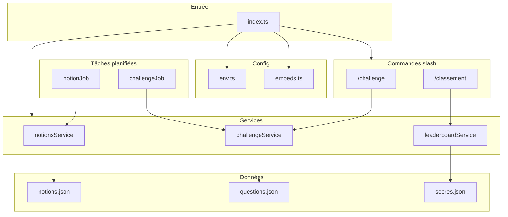

# ?? Bot Discord Révision RNCP

[](package.json)
[](LICENSE)
[](package.json)
[](package.json)
[](package.json)

**Bot Discord pour la révision du Titre RNCP Développeur Web & Web Mobile** : notions automatiques, challenges quiz et classement dans le salon #discussions. Premier qui répond gagne (rôle + classement). Tout se passe dans Discord, sans application externe ? Node.js, TypeScript, slash commands, embeds et cron.

---

## ? En bref

- **Commandes slash** : `/challenge` et `/classement` dans le serveur
- **Notions automatiques** : envoi périodique de blocs RNCP (front-end, back-end, transversal) dans #discussions
- **Challenges quiz** : lancement manuel ou via cron ; le premier à répondre correctement gagne un rôle et des points
- **Classement** : top 10 des gagnants avec nombre de victoires

---

## ?? Navigation

? [?? Démarrage rapide](#-démarrage-rapide) ? [?? Documentation](#-documentation) ? [?? Architecture](#-architecture) ? [?? Configuration](#?-configuration) ? [?? Licence](#-licence)

---

## ?? Démarrage rapide

### Prérequis

- **Node.js** 18 ou supérieur
- Un **compte Discord** et un serveur où vous avez les droits d?administrateur
- Un **bot** créé sur le [Discord Developer Portal](https://discord.com/developers/applications) (voir [docs/setup.md](docs/setup.md))

### Installation

```bash
npm install
cp .env.example .env
# Éditer .env : DISCORD_TOKEN, DISCUSSIONS_CHANNEL_ID, WINNER_ROLE_ID
npm run build
npm start
```

---

## ?? Architecture

Schéma des flux et des composants du bot :



| Dossier | Rôle |
|--------|------|
| `src/` | Point d?entrée, commandes, services, jobs, config |
| `src/config/` | Configuration centralisée (env, embeds) |
| `src/commands/` | Commandes slash `/challenge`, `/classement` |
| `src/services/` | Logique métier : notions, challenge, leaderboard |
| `src/jobs/` | Tâches planifiées (node-cron) |
| `lib/` | Utilitaires : normalisation, lecture/écriture JSON |
| `types/` | Types TypeScript (Notion, Question, Scores) |
| `data/` | Fichiers JSON (notions, questions, scores) |

Détails : [docs/architecture.md](docs/architecture.md).

---

## ?? Configuration

Remplir le fichier `.env` à la racine (à partir de `.env.example`) :

| Variable | Description |
|----------|-------------|
| `DISCORD_TOKEN` | Token du bot (Developer Portal ? Bot ? Reset Token) |
| `DISCUSSIONS_CHANNEL_ID` | ID du salon #discussions (clic droit sur le salon ? Copier l?identifiant) |
| `WINNER_ROLE_ID` | ID du rôle à donner aux gagnants (Paramètres serveur ? Rôles ? Copier l?identifiant) |

Configuration détaillée (cron, options) : [docs/setup.md](docs/setup.md).

---

## ?? Commandes

| Commande | Description |
|----------|-------------|
| `/challenge` | Lance un challenge quiz dans le salon actuel. Le premier à répondre correctement gagne (rôle + classement). |
| `/classement` | Affiche le classement des gagnants (top 10) avec le nombre de victoires. |

Comportement détaillé : [docs/commands.md](docs/commands.md).

---

## ?? Données

| Fichier | Rôle |
|---------|------|
| `data/notions.json` | Notions à poster (blocs RNCP front-end, back-end, transversal) |
| `data/questions.json` | Questions des challenges |
| `data/scores.json` | Classement (généré automatiquement) |

---

## ? Qualité

- **Tests** : `npm test` (normalisation des réponses, validation des entrées)
- **Build** : `npm run build` (TypeScript)
- **Lint** : `npm run lint`
- **Config** : validation des variables d?environnement au démarrage ; aucun secret loggé

---

## ?? Documentation

| Document | Contenu |
|----------|---------|
| [docs/setup.md](docs/setup.md) | Création du bot, IDs, configuration complète |
| [docs/commands.md](docs/commands.md) | Commandes et comportement |
| [docs/architecture.md](docs/architecture.md) | Architecture, flux, sécurité |

---

## ?? Licence

MIT ? voir [package.json](package.json) et [LICENSE](LICENSE).

---

<details>
<summary>À propos du système multi-agents (Cursor)</summary>

Ce dépôt peut être utilisé avec un système d?orchestration multi-agents (fichier de configuration + rôles par domaine). Les rôles sont organisés par catégories fonctionnelles et sont chargés dynamiquement pour les tâches de développement, documentation et déploiement. Le focus principal reste le bot Discord décrit ci-dessus.
</details>
