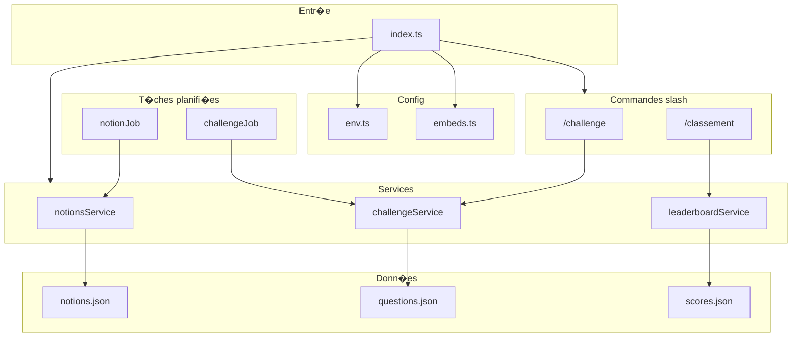

# Bot Discord R�vision RNCP

[](package.json)
[](LICENSE)
[](package.json)
[](package.json)
[](package.json)

**Bot Discord pour la r�vision du Titre RNCP D�veloppeur Web & Web Mobile** : notions automatiques, challenges quiz et classement dans le salon #discussions. Premier qui r�pond gagne (r�le + classement). Tout se passe dans Discord, sans application externe ? Node.js, TypeScript, slash commands, embeds et cron.

---

## En bref

- **Commandes slash** : `/challenge` et `/classement` dans le serveur
- **Notions automatiques** : envoi p�riodique de blocs RNCP (front-end, back-end, transversal) dans #discussions
- **Challenges quiz** : lancement manuel ou via cron ; le premier � r�pondre correctement gagne un r�le et des points
- **Classement** : top 10 des gagnants avec nombre de victoires

---

## Navigation

- [D�marrage rapide](#d�marrage-rapide)
- [Documentation](#documentation)
- [Architecture](#architecture)
- [Configuration](#configuration)
- [Licence](#licence)

---

## D�marrage rapide

### Pr�requis

- **Node.js** 18 ou sup�rieur
- Un **compte Discord** et un serveur o� vous avez les droits d'administrateur
- Un **bot** cr�� sur le [Discord Developer Portal](https://discord.com/developers/applications) (voir [docs/setup.md](docs/setup.md))

### Installation

```bash
npm install
cp .env.example .env
# �diter .env : DISCORD_TOKEN, DISCUSSIONS_CHANNEL_ID, WINNER_ROLE_ID
npm run build
npm start
```

---

## Architecture

Sch�ma des flux et des composants du bot :



| Dossier | R�le |
|--------|------|
| `src/` | Point d'entr�e, commandes, services, jobs, config |
| `src/config/` | Configuration centralis�e (env, embeds) |
| `src/commands/` | Commandes slash `/challenge`, `/classement` |
| `src/services/` | Logique m�tier : notions, challenge, leaderboard |
| `src/jobs/` | T�ches planifi�es (node-cron) |
| `lib/` | Utilitaires : normalisation, lecture/�criture JSON |
| `types/` | Types TypeScript (Notion, Question, Scores) |
| `data/` | Fichiers JSON (notions, questions, scores) |

D�tails : [docs/architecture.md](docs/architecture.md).

---

## Configuration

Remplir le fichier `.env` � la racine (� partir de `.env.example`) :

| Variable | Description |
|----------|-------------|
| `DISCORD_TOKEN` | Token du bot (Developer Portal ? Bot ? Reset Token) |
| `DISCUSSIONS_CHANNEL_ID` | ID du salon #discussions (clic droit sur le salon ? Copier l'identifiant) |
| `WINNER_ROLE_ID` | ID du r�le � donner aux gagnants (Param�tres serveur ? R�les ? Copier l'identifiant) |

Configuration d�taill�e (cron, options) : [docs/setup.md](docs/setup.md).

---

## Commandes

| Commande | Description |
|----------|-------------|
| `/challenge` | Lance un challenge quiz dans le salon actuel. Le premier � r�pondre correctement gagne (r�le + classement). |
| `/classement` | Affiche le classement des gagnants (top 10) avec le nombre de victoires. |

Comportement d�taill� : [docs/commands.md](docs/commands.md).

---

## Donn�es

| Fichier | R�le |
|---------|------|
| `data/notions.json` | Notions � poster (blocs RNCP front-end, back-end, transversal) |
| `data/questions.json` | Questions des challenges |
| `data/scores.json` | Classement (g�n�r� automatiquement) |

---

## Qualit�

- **Tests** : `npm test` (normalisation des r�ponses, validation des entr�es)
- **Build** : `npm run build` (TypeScript)
- **Lint** : `npm run lint`
- **Config** : validation des variables d'environnement au d�marrage ; aucun secret logg�

---

## Documentation

| Document | Contenu |
|----------|---------|
| [docs/setup.md](docs/setup.md) | Cr�ation du bot, IDs, configuration compl�te |
| [docs/commands.md](docs/commands.md) | Commandes et comportement |
| [docs/architecture.md](docs/architecture.md) | Architecture, flux, s�curit� |

---

## Licence

MIT ? voir [package.json](package.json) et [LICENSE](LICENSE).

---

<details>
<summary>� propos du syst�me multi-agents (Cursor)</summary>

Ce d�p�t peut �tre utilis� avec un syst�me d'orchestration multi-agents (fichier de configuration + r�les par domaine). Les r�les sont organis�s par cat�gories fonctionnelles et sont charg�s dynamiquement pour les t�ches de d�veloppement, documentation et d�ploiement. Le focus principal reste le bot Discord d�crit ci-dessus.
</details>
